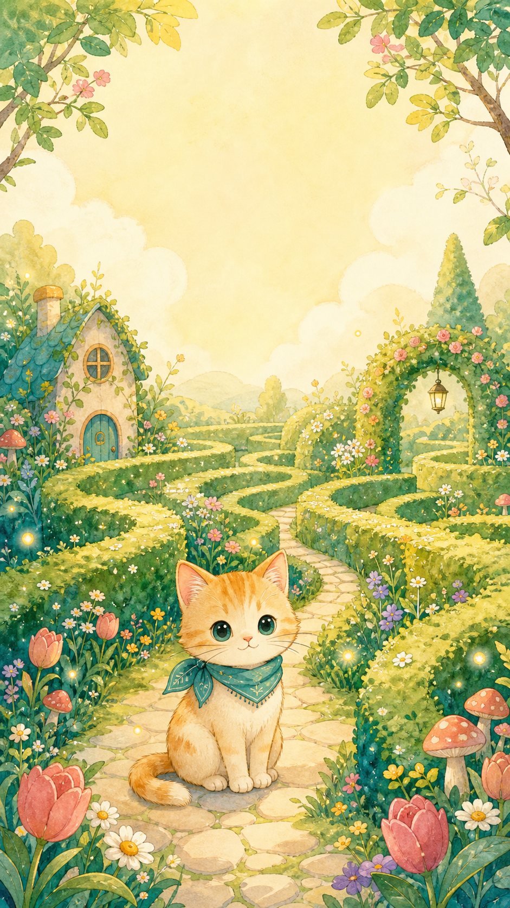
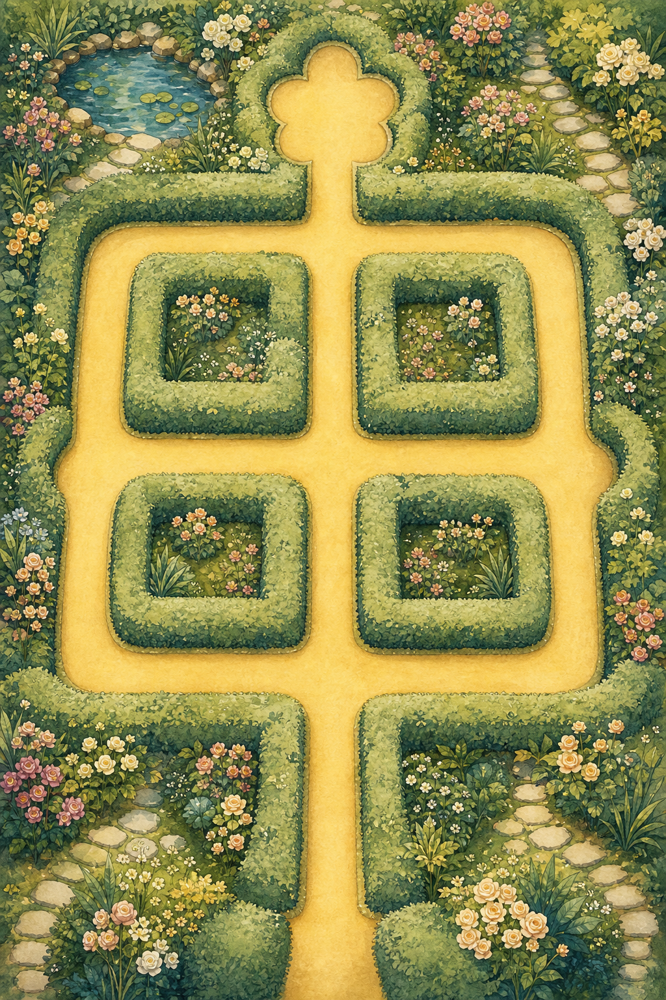
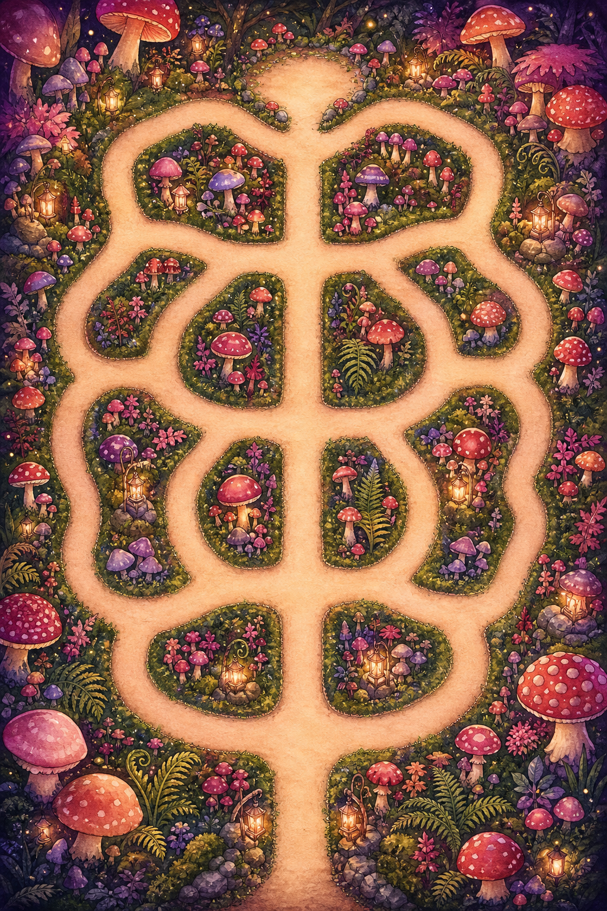
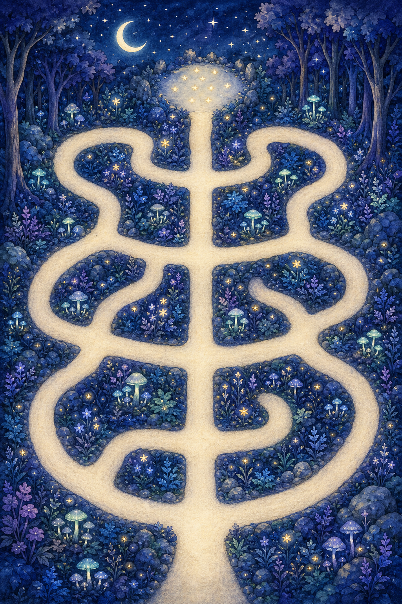
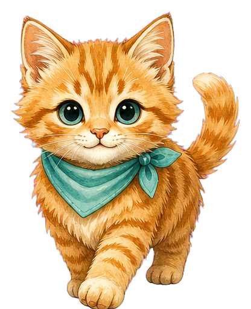
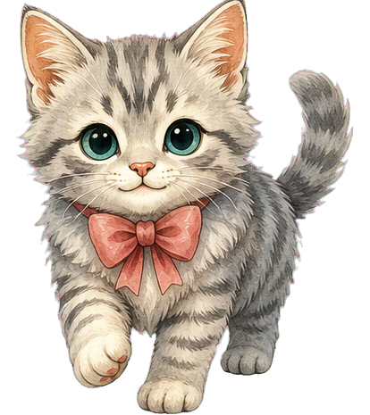
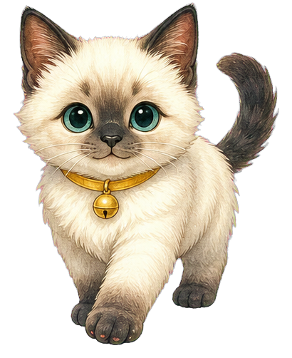

# 🐾 小猫迷宫大冒险

### 跟着一只小猫，走进会发光的童话花园

轻轻滑动手指，带小猫穿过蜿蜒的小路。 
找齐香喷喷的小鱼干，避开正在散步的小老鼠，一起抵达星光闪闪的终点。

### [✨ 现在开始冒险](https://www.sunky.net/cat-maze-adventure/)

无需下载，也不用登录。用手机打开，就能直接游玩。

## 一场温柔的小冒险

这里没有可怕的追逐，也没有复杂的规则。

按住小猫，沿着画面里的小路滑动手指。岔路口藏着不同的风景和小鱼干，也可能遇见悠闲散步的小老鼠。耐心等一等，或换一条路，就能继续前进。

每一关都可以反复探索。找到的小鱼干越多，通关时点亮的星星就越多。

## 三段各不相同的旅程

<table>
  <tr>
    <td align="center" width="33%"></td>
    <td align="center" width="33%"></td>
    <td align="center" width="33%"></td>
  </tr>
  <tr>
    <td align="center"><strong>🌼 花园迷宫</strong> 穿过花香和树篱，认识迷宫里的第一条岔路。</td>
    <td align="center"><strong>🍄 蘑菇小径</strong> 在弯弯绕绕的蘑菇路上，寻找藏起来的小鱼干。</td>
    <td align="center"><strong>🌙 星光森林</strong> 走进月光与萤火之间，完成最后一场梦幻冒险。</td>
  </tr>
</table>

## 选择你的冒险伙伴

  
  
  

**橘子、云朵、月牙**，三只小猫都在等你。 
它们会跑动、张望、伸懒腰，偶尔还会认真地“喵”一声。

## 小小探险指南

- 🐱 按住小猫，再沿着道路滑动手指。
- 🐟 尽量找齐每关的三条小鱼干。
- 🐭 遇到小老鼠不用着急，等它走开或选择另一条路。
- ⭐ 抵达终点后，会根据收集结果获得一至三颗星。
- 🔊 音乐和声音可以随时关闭。
- 🌿 已经找到的鱼干不会因为碰到老鼠而消失。

## 为轻松和快乐而设计

《小猫迷宫大冒险》是一款适合手机竖屏游玩的中文小游戏。它没有广告、付费内容或复杂文字，希望每一次打开，都像走进一本会动、会唱歌的童话绘本。

你可以慢慢走、反复探索，也可以把游戏分享给喜欢小猫、花园和迷宫的朋友。

### 准备好了吗？

### [🐾 带一只小猫出发](https://www.sunky.net/cat-maze-adventure/)

愿你找到所有小鱼干，也找到属于自己的那条小路。

